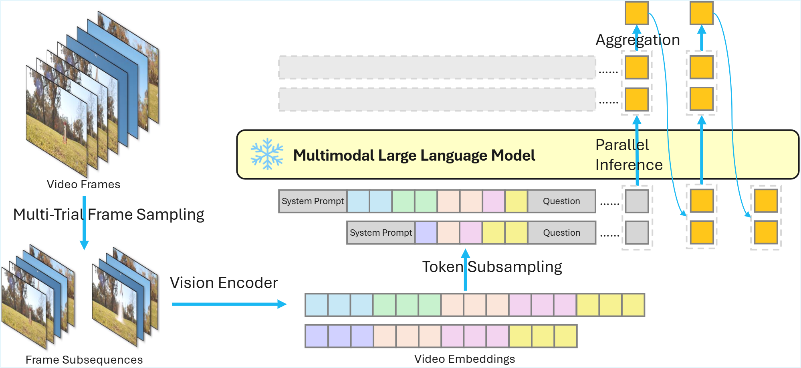

# Test-Time Temporal Sampling for Efficient MLLM Video Understanding (T3S)

[](https://arxiv.org/abs/2511.17945) 
[](https://opensource.org/licenses/MIT)
[](https://github.com/kaibinwang3/T3S)

This repository contains the official implementation of the paper: **"Test-Time Temporal Sampling for Efficient MLLM Video Understanding"**.

**T3S** is a **training-free, plug-and-play** inference wrapper that enables Multimodal Large Language Models (MLLMs) to process long videos efficiently. By exploiting spatiotemporal redundancy, T3S generates multiple short, diverse subsequences and aggregates their predictions, reducing the computational cost of self-attention from $\mathcal{O}(L^2)$ to $\mathcal{O}(\sum \alpha_i^2L^2)$.

## Key Features

- **Efficient:** Reduces first-token latency by up to **2.04x** on long videos.
- **Effective:** Improves accuracy by up to **3.1%** on benchmarks like LongVideoBench.
- **Training-Free:** No fine-tuning or adapter training required. Works directly with pre-trained models.
- **Universal:** Plug-and-play compatibility with state-of-the-art MLLMs.

## Methodology

Instead of processing a single long sequence of video tokens, T3S performs $m$ independent sampling trials. In each trial, it:
1.  **Frame Sampling:** Randomly selects $N$ frames to maximize temporal coverage.
2.  **Token Subsampling:** Retains only a fraction $\alpha$ of visual tokens to reduce spatial redundancy.
3.  **Aggregation:** Packs subsequences into a single forward pass and aggregates logits (via averaging or cross-refinement).

<div align="center">
  
</div>

## Usage

T3S is designed to wrap around existing MLLM inference pipelines.

### Basic Inference
To run inference on a video using T3S with Qwen2.5-VL:

```bash
python t3s_qwen2vl_demo.py
```

## Evaluation

We evaluate T3S on **VideoMME**, **LongVideoBench**, and **MLVU**. The scripts below utilize `VLMEvalKit`.

```bash
bash eval_t3s_qwen2vl.sh
bash eval_t3s_llava.sh
bash eval_t3s_oryx.sh
bash eval_fastv_qwen2vl.sh
bash eval_vtw_qwen2vl.sh
```

### Main Results

**Accuracy (%) and Speedup Comparison:**

| Model | VideoMME (short) | VideoMME (medium) | VideoMME (long) | VideoMME (overall) | Speedup |
| :--- | :---: | :---: | :---: | :---: | :---: |
| Qwen2.5-VL-7B | 0.746 | 0.637 | 0.536 | 0.639 | - |
| + T3S | 0.766 | 0.644 | 0.546 | 0.652 | 2.03x |
| LLaVA-Video-7B | 0.758 | 0.627 | 0.536 | 0.640 | - |
| + T3S | 0.774 | 0.633 | 0.545 | 0.651 | 1.69x |
| Oryx-1.5-7B | 0.711 | 0.559 | 0.516 | 0.595 | - |
| + T3S | 0.717 | 0.561 | 0.526 | 0.601 | 1.32x |


| Model | LongVideoBench (15) | LongVideoBench (60) | LongVideoBench (600) | LongVideoBench (3600) | LongVideoBench (overall) | Speedup |
| :--- | :---: | :---: | :---: | :---: | :---: | :---: |
| Qwen2.5-VL-7B | 0.720 | 0.750 | 0.578 | 0.512 | 0.592 | - |
| + T3S | 0.751 | 0.762 | 0.631 | 0.535 | 0.623 | 2.04x |
| LLaVA-Video-7B | 0.672 | 0.721 | 0.561 | 0.479 | 0.562 | - |
| + T3S | 0.693 | 0.727 | 0.604 | 0.505 | 0.591 | 1.50x |
| Oryx-1.5-7B 256frm | 0.614 | 0.703 | 0.566 | 0.518 | 0.570 | - |
| + T3S | 0.646 | 0.703 | 0.578 | 0.535 | 0.586 | 1.31x |

| Model | MLVU (PQA) | MLVU (NQA) | MLVU (ER) | MLVU (AC) | MLVU (AO) | MLVU (AR) | MLVU (TR) | MLVU (M-Avg) | Speedup |
| :--- | :---: | :---: | :---: | :---: | :---: | :---: | :---: | :---: | :---: |
| Qwen2.5-VL-7B | 0.729 | 0.808 | 0.608 | 0.340 | 0.514 | 0.770 | 0.890 | 0.683 | - |
| + T3S | 0.740 | 0.794 | 0.616 | 0.354 | 0.602 | 0.765 | 0.890 | 0.697 | 2.01x |
| LLaVA-Video-7B | 0.775 | 0.808 | 0.656 | 0.393 | 0.625 | 0.685 | 0.874 | 0.688 | - |
| + T3S | 0.777 | 0.749 | 0.622 | 0.461 | 0.606 | 0.705 | 0.863 | 0.701 | 1.72x |
| Oryx-1.5-7B | 0.770 | 0.803 | 0.645 | 0.413 | 0.483 | 0.700 | 0.867 | 0.692 | - |
| + T3S | 0.776 | 0.802 | 0.631 | 0.379 | 0.494 | 0.685 | 0.882 | 0.690 | 1.23x |

## Project Structure

Below are list of files that we added or modified.

```
T3S/
├── vlmevala/
│   └── vlm/
│       ├── qwen2_vl/
│       │   ├── fastv_qwen2vl.py
│       │   ├── t3s_qwen2vl.py
│       │   ├── t3s_qwen2vl_mcq.py
│       │   └── vtw_qwen2vl.py
│       ├── llava/
│       │   └── t3s_llava_mcq.py
│       └── oryx/
│           └── t3s_oryx_mcq.py
├── eval_fastv_qwen2vl.sh
├── eval_t3s_llava.sh
├── eval_t3s_oryx.sh
├── eval_t3s_qwen2vl.sh
├── eval_vtw_qwen2vl.sh
└── README.md
```

## Citation

If you find T3S useful for your research, please cite our paper:

```bibtex
@article{wang2026t3s,
  title={Test-Time Temporal Sampling for Efficient MLLM Video Understanding},
  author={Wang, Kaibin and Lin, Mingbao},
  journal={arXiv preprint},
  year={2026}
}
```
## 🙏 Acknowledgements

This project is built upon [VLMEvalKit](https://github.com/open-compass/VLMEvalKit). We thank the authors for their great contribution to the open-source community.
